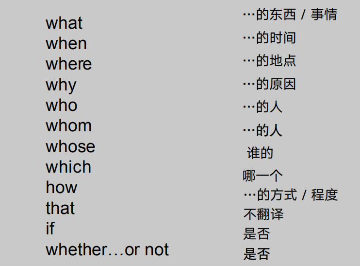

## 词性

## 句型

- 简单句
  - 定义：由一个主语和一个谓语构成的句子（只有一套主谓关系）、
    - I love this beautiful girl.

- 复合句
  - 定义：将两个或者两个以上的简单句组合成一个句子
  - 并列复合句
    - I like apples,but i don't like oranges.
  - 主从复合句
    - I like apples that you gave me yesterday

- 定语从句
  - 定义：主要是修饰名词
  - 涉及关系代词：who /whom/which/that
     - 使用情况：从句缺成分
     - 主谓结构：谓语动词是不及物动词 
     - 主谓宾结构：谓语动词是及物动词
     - 例句
       - He is the man who wangts to see you .
       - This is the tree that I planted.
       - The bag which you carry is about to come unwrapped.
  - 涉及关系副词   when /where/ why
     - 使用情况：从句不缺成分
        - There are occasions when one must yiled.
        - Beijing is the place wehre I  was born.
        - Is this the reason why he refused our offer?
     - 用whose:空格前面的词加个's（....的）与空格后的词连接起来通顺就用whose
        - Please pass me the book whose cover is green.

- 状语从句

  - 定义：修饰动词，定语或整个句子

    - His wife was cooking while John was watching TV
    - Go back where you came from 

  - 时间状语从句

    - when（当）/while（当）/as（当，随着）/as soon as（一…就…)/until（直到） 

      /not until（直到…才…）/since（自从）/once（一旦）/the+时间（在…时）

    - When you see him, please send my regard. 当你见到他，请代我问好。 

      My mother came in while I was doing my homework. 

      我正做作业时候我妈进来了。 

      As I watched him, he dived into the water. 

      正当我看着他，他潜进了水里。 

      I will call you as soon as I get home. 

      我一到家就给你打电话。 

      I work very hard until my boss leaves the company. 

      我非常努力工作，直到我老板离开公司。 

  - 地点状语从句

    - where（在…的地方）
      - I am sitting where I sat last time.

  - 原因状语从句

    - because（因为…）since（因为…）as（因为…）for（因为…） 
      - I bought this for you because/since/as/for you will need it. 

  - 结果状语从句

    - so…that…（太…以至于）such…that…（如此…以至于）
      - This student is so smart that every teacher likes him.
      - He is such a smart student that every teacher likes him.

  - 目的状语从句

    - so that（以便于）in order that（以便于）in case（以免）
      - I get up early every day so that/in order that I could get on the first bus.

  - 条件状语从句

    - if （如果）unless（除非）as long as（只要）
      - If he comes, tell him I want to see him.

  - 让步状语从句

    - although（虽然）though（虽然）even if（即使）even though（尽管) 

      whether（无论）while（虽然，既然）now that（既然） 特殊疑问 

      词+ever = no matter + 特殊疑问词（无论…）

      - Although/though/while he is still a boy, he knows a lot about current events. 

- 名词性从句

  - 他说的话很重要

    - What he said is important

  - 关键字

    

## 动词

- 种类

  

- 实义动词（行为动词）

  - 及物动词:后面要跟上一个名词或者代词来做宾语
    - The boy watches TV on Sundays
  - 不及物动词：不能直接跟宾语，单可以跟上一个介词，构成动词短语，再跟一个介词宾语
    - He is looking at the picture.

- 系动词

  - 定义：本身有含义，但它不能单独做谓语后面必须接表语，用来说明主要的状况、性质、特征等，一起构成主系表结构
  - 分类
    - be动词（am  is   are was  were）
    - 表示感受的“感官动词
      - look,taste,smell,sound,feel 感官动词   + 形容词 (adj.)

- 情态动词

  - 定义：表示说话人的情绪、态度和语气。情态动词没有人称和数的变化

    - He can speak English.

  - 本身有词义，单词义不完全，不能单独做谓语，其后接动词原型 ***

    - can(could), may(might),will(would), 

      shall( should), must, have to, had better…   + v .原型   **情态动词＋****v.****原**

  -  表推测

    - must -> can -> could -> may -> might  (由强到弱)

- 助动词

  - 定义：协助主要动词构成谓语的动词叫助动词，它对谓语动词起辅助作用。助动词本身没有含义，不可单独使用
  - 常见助动词：do(does,did),have(has),will
  - 使用：
    - 助动词本身没有意义，它只是帮助主要动词构成谓语，表示疑问，否定句、时态等
      - 表示时态
        - We have finished this semester.
      - 构成疑问句
        - Do you like collecting stamps?
      - 与not 合用，构成否定句
        - I dont't want to visit that farm?

## 时态

- 一般现在时

  - 现在或经常发生的事情，客观事实
  - 构成:主语 + do /does

- 一般过去时

  - 过去发生的事情 ，好现在没有关系
  - 构成：主语+ did

- 一般将来时

  - 将来要发生的事情
  - 构成：主语 + will do /be going to to 

- 现在进行时

  - 表示现在正在做某事
  - 构成： am /is /are +doing
    - I am listening to music.

- 过去进行时

  - 表示过去某个时间点或时间段正在做某事
  - 构成：was /were + doing
    - I was listening to music at that time.

- 将来进行时

  - 表示将来某个时间点或时间段正在做某事
  - 构成：will be + doing
    - I will be watching a film tomorrow evening .

- 现在完成时

  - 表示已经发生的事情
  - 表示过去发生的事情持续到现在并对现在造成一定的影响，是唯一能把过去和现在连接起来的时态，常常与already(肯定句中)，yet(否定，疑问，句末)，just,before,recently,still,lately,ever等连用。
  - 构成：have/has + 过去分词（done）
    - I have already read the book.
    - Sorry,he has not finished the task yet,
    - We have seen that film before.

- 过去完成时

  - 表示过去的过去
  - 是一个比较的时态，必须和过去相比，在过去之前才能用过去完成时
  - 构成：had + 过去分词(done)
    - I returned the book that I had borrowed.

- 被动语态

  - 构成：be + done
    - The chair is made by wood.
    - The chair was made by me

- 非谓语

  - 一个句子只有一个谓语动词，如果有一个谓语动词了，还要用一个动词，这个动词就要用非谓语的形式

    

    - 动名词doing 
      - The story is really fun.
      - Playing basketball is really fun
      -  非谓语动词与相关句子成分要看做一个整体,如上面的The story,Playing basketball
    - 分词
      - doing 现在分词   主动
        - Write to the editor, hoping** that the editor would be** able to help her. (do)
      - done 过去分词  被动
        - With the work **done****, they went out to play. (do)**
    - 做定语（功能相当于adj.）
      - The man speaking to the teacher is our monitor's father.
      - He is reading a book written by Bill Gates.
    - to do "去"做
      - It is + adj, + (for sb.) +to do 
      - 表目的，为了。。。
      - make / let / have  + sb.+ do = 让某人做某事
        - It is importtant for me to study.
        - He made this decision to calm him down.
        - I hava my hai cut.

- 特殊句式

  - There be ...(有。。。)

  - There is /are

  - There was /were + a tree/trees over there.(There be + n. + 方位副词)

  - There will be.

  - There be +n+doing

    - 有某人正在做某事

      - There are some boys play basketball
      - There are some boys playing basketball.

  - 强调句

    - It is (was) + 被强调的部分 + that (who) + 其余部分
      - It was Tom who cleaned the room yesterday.
      - It was the room that Tom cleaned yesterday
      - It was yesterday that Tom cleaned the room

- 虚拟语气

  - 对现在虚拟句子结构

    - If + 主语 + 动词过去式(be 只用were),主语+ would / could / should / might + 动词原型

      - If I were you，I would fly to you .
  - 对过去虚拟语气结构
    - If +主语+ had done ， 主语+ would/could/should/might +have done 
      - If we had started earlier, we should have not missed the train
  - 对将来虚拟句子结构
    - If +Should/were to +动词原形， Would/could/should/might+动词原形 
      - If you were to get a full mark next time, I would hold a party for you.

    

    

    

    

    

    

